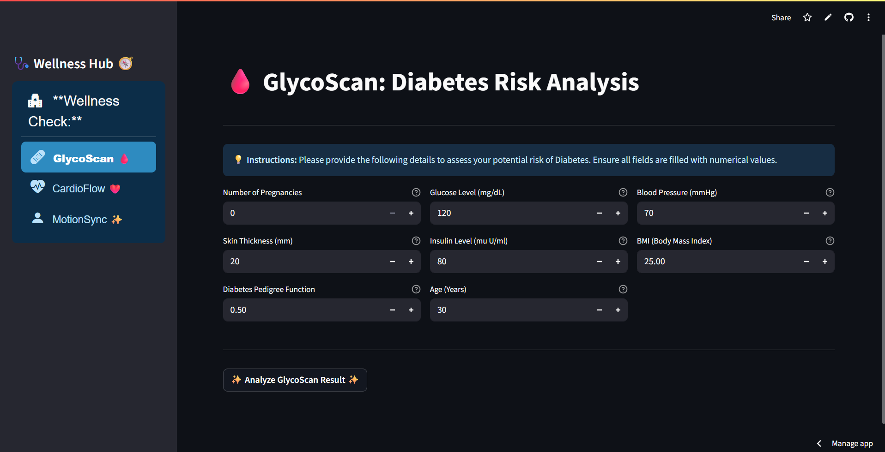

# Harmonic Health: Predictive Wellness Hub

## 🌟 Overview

**Harmonic Health** is an intuitive and user-friendly web application designed to empower individuals with preliminary insights into their potential risk for three common health conditions: Diabetes, Heart Disease, and Parkinson's Disease. Leveraging pre-trained machine learning models, this app provides quick and easy assessments based on user-inputted health metrics.

## ✨ Features

* **GlycoScan (Diabetes Risk Analysis):** Predicts the likelihood of diabetes based on factors like pregnancies, glucose levels, BMI, and age.

* **CardioFlow (Heart Health Insights):** Assesses heart disease risk using cardiovascular metrics such as blood pressure, cholesterol, chest pain type, and maximum heart rate.

* **MotionSync (Parkinson's Assessment):** Evaluates the potential presence of Parkinson's disease using various voice measurement parameters.

* **Interactive Interface:** Clean and aesthetic design built with Streamlit for an engaging user experience.

* **Real-time Feedback:** Provides immediate predictions based on user inputs.

## 🚀 Live Demo

Experience the Harmonic Health app live on Streamlit Cloud:
👉 <https://harmonic-health.streamlit.app/>

## 🛠️ Technologies Used

* **Python:** The core programming language.

* **Streamlit:** For building the interactive web application interface.

* **`streamlit-option-menu`:** For the elegant sidebar navigation.

* **`scikit-learn`:** (Implicitly used) The machine learning library from which the prediction models (`.sav` files) are derived.

* **`pickle`:** For loading the pre-trained machine learning models.

## 📈 Usage

Once the app is running (either locally or on Streamlit Cloud):

1.  Use the **sidebar navigation** on the left to select the health assessment you wish to perform: `GlycoScan`, `CardioFlow`, or `MotionSync`.

2.  **Fill in the numerical input fields** with the requested health metrics. Each field has a helpful tooltip (`💡`) for guidance.

3.  Click the `✨ Analyze [Assessment] Result ✨` button.

4.  The app will display a preliminary prediction based on the inputted data.

## 📊 Data Models

This application uses pre-trained machine learning models. These models were trained on specific datasets relevant to each disease prediction task (e.g., Pima Indians Diabetes Dataset, UCI Heart Disease Dataset, UCI Parkinson's Dataset, etc.). The `.sav` files are serialized versions of these trained models.

## 🙌 Acknowledgements

* Built with [Streamlit](https://streamlit.io/).

* Sidebar navigation powered by [streamlit-option-menu](https://github.com/victoryhb/streamlit-option-menu).

* Machine learning models are based on standard algorithms from the `scikit-learn` library.

